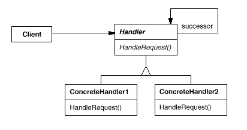

# Поведенчески шаблони ( Behavioral Patterns):

 *   Chain of Responsibility
 *   Strategy Pattern
 *   Observer Pattern
 *   Visitor Pattern

## Chain of Responsibility
### Описание
* Когато пишем приложения от най-различен тип, често се налага някое събитие генерирано от даден обект да бъде обработено от друг обект.
* В тези случаи може да използваме шаблона за дизайн Chain of Responsibility. Той ни позволява да изпратим команда, без да знаем предварително кой точно обект ще я изпълни.  
* Предварително условие за това е всички обекти които биха могли да изпълнят командата ни да пазят референция един към друг, за да може да си прехвърлят заявката докато някой успее да я изпълни. 
* Chain of Responsibility ни позволява да разкачим дадена заявка от това кой точно ще я изпълни, давайки ни по-голяма гъвкавост, да достигнем до най-подходящия "Handler".
### Недостатък
* Най-големия недостатък на този шаблон за дизайн е, че много лесно може да бъде "счупен", ако например програмистта който го имплементира забрави да добави връзка за следващия Handler на дадена заявка.
### Клас диаграма:


Примерен код:

	~~~
	c#
	internal class Loan
    {
        public Loan(string purpose, decimal amount)
        {
            this.Purpose = purpose;
            this.Amount = amount;
        }

        public string Purpose { get; set; }

        public decimal Amount { get; set; }        
    }

	internal abstract class LoanHandler
    {
        protected LoanHandler Successor { get; set; }

        public void SetSuccessor(LoanHandler successor)
        {
            this.Successor = successor;
        }

        public abstract void ApproveRequest(Loan loanRequest);
    }

	internal class Clerk : LoanHandler
    {
        private const decimal ApproveLimit = 10000M;

        public override void ApproveRequest(Loan loanRequest)
        {
            if (loanRequest.Amount < ApproveLimit)
            {
                Console.WriteLine("Approved {0:C2} loan for {1} by the Bank {2}", loanRequest.Amount, loanRequest.Purpose, this.GetType().Name);                  
            }
            else if (this.Successor != null)
            {
                this.Successor.ApproveRequest(loanRequest);
            }
        }
    }

	public class Client
	    {
	        public static void Main()
	        {
	            LoanHandler lowLevelClerk = new Clerk();
	            LoanHandler midLevelManager = new AssistanManager();
	            LoanHandler topExecuive = new GeneralManager();
	
	            lowLevelClerk.SetSuccessor(midLevelManager);
	            midLevelManager.SetSuccessor(topExecuive);
	
	            var loan = new Loan("New Laptop", 1999);
	            lowLevelClerk.ApproveRequest(loan);
	
	            loan = new Loan("Fancy Sport Car", 180000);
	            lowLevelClerk.ApproveRequest(loan);
	
	            loan = new Loan("House in Miami", 1750000);
	            lowLevelClerk.ApproveRequest(loan);
	
	            loan = new Loan("Shiny Yacht", 12000000);
	            lowLevelClerk.ApproveRequest(loan);
	        }
	    }
	~~~
# Strategy Pattern
### Мотивация
 * Служи за  постигане на дадена цел по различни начини. Входните данни и крайният резултат са еднакви. Чрез избора ни на стратегия решаваме по какъв начин точно да се достигне до този резултат. 
### Цел
 * Капсулиране на логиката за извършване на определено действие, вдигане на абстракцията и лесна подмяна на въпросната логика при необходимост	
#### Последствия
* Лесно добаване на нови стратегии 
### Сродни модели
* Понякога се бърка с Bridge pattern
### Проблеми
* Комуникацията между ползвателя на стратегията и класа, който я представлява се случва през базов абстрактен клас, който трябва да осигури интерфейс за всички видове стратегии и понякога би могло да се случи така, че някоя стратегия да няма нужда от някой компонент на интерфейса.
### Известни употреби
* C# sorting strategy, hashing algorithms strategies, encrypting algorithms strategies
### Клас диаграма:
 

Примерен код: 

	```c#
	using System;
	using System.Collections.Generic;
	 
	namespace DoFactory.GangOfFour.Strategy.RealWorld
	{
	  /// <summary>
	  /// MainApp startup class for Real-World 
	  /// Strategy Design Pattern.
	  /// </summary>
	  class MainApp
	  {
	    /// <summary>
	    /// Entry point into console application.
	    /// </summary>
	    static void Main()
	    {
	      // Two contexts following different strategies
	      SortedList studentRecords = new SortedList();
	 
	      studentRecords.Add("Samual");
	      studentRecords.Add("Jimmy");
	      studentRecords.Add("Sandra");
	      studentRecords.Add("Vivek");
	      studentRecords.Add("Anna");
	 
	      studentRecords.SetSortStrategy(new QuickSort());
	      studentRecords.Sort();
	 
	      studentRecords.SetSortStrategy(new ShellSort());
	      studentRecords.Sort();
	 
	      studentRecords.SetSortStrategy(new MergeSort());
	      studentRecords.Sort();
	 
	      // Wait for user
	      Console.ReadKey();
	    }
	  }
	 
	  /// <summary>
	  /// The 'Strategy' abstract class
	  /// </summary>
	  abstract class SortStrategy
	  {
	    public abstract void Sort(List<string> list);
	  }
	 
	  /// <summary>
	  /// A 'ConcreteStrategy' class
	  /// </summary>
	  class QuickSort : SortStrategy
	  {
	    public override void Sort(List<string> list)
	    {
	      list.Sort(); // Default is Quicksort
	      Console.WriteLine("QuickSorted list ");
	    }
	  }
	 
	  /// <summary>
	  /// A 'ConcreteStrategy' class
	  /// </summary>
	  class ShellSort : SortStrategy
	  {
	    public override void Sort(List<string> list)
	    {
	      //list.ShellSort(); not-implemented
	      Console.WriteLine("ShellSorted list ");
	    }
	  }
	 
	  /// <summary>
	  /// A 'ConcreteStrategy' class
	  /// </summary>
	  class MergeSort : SortStrategy
	  {
	    public override void Sort(List<string> list)
	    {
	      //list.MergeSort(); not-implemented
	      Console.WriteLine("MergeSorted list ");
	    }
	  }
	 
	  /// <summary>
	  /// The 'Context' class
	  /// </summary>
	  class SortedList
	  {
	    private List<string> _list = new List<string>();
	    private SortStrategy _sortstrategy;
	 
	    public void SetSortStrategy(SortStrategy sortstrategy)
	    {
	      this._sortstrategy = sortstrategy;
	    }
	 
	    public void Add(string name)
	    {
	      _list.Add(name);
	    }
	 
	    public void Sort()
	    {
	      _sortstrategy.Sort(_list);
	 
	      // Iterate over list and display results
	      foreach (string name in _list)
	      {
	        Console.WriteLine(" " + name);
	      }
	      Console.WriteLine();
	    }
	  }
	}
	  ```
## Observer Pattern
### Мотивация
 * Шаблон, който ни представя функционалност за информиране на дадени обекти, че в друг обект е настъпила определена промяна. Обектите, които се интересуват от конкретната промяна в друг обект го заявяват и от там нататък при всяка следваща настъпила промяна, те ще бъдат уведомени. Първата стъпка е да създадем прихващач на определено събитие. След това всеки обект, който се интересува от настъпването на събитието се абонира. Когато настъпи дадена промяна в въпросния обект, прихващача на събитието информира всичи записали се обекти. От там нататък всеки от тях решава как да отрази състоялото се събитие.
### Цел
 * Да създаде 1:many връзка между обект и всички обекти, които се интересуват от него, така че когато въпросният обект промени състоянието си, всички да бъдат информирани.	    
### Известни употреби
* allowing notificaitons, subscribing for different stuff in internet

 * Дефинира връзка "едно към много" между различни обекти
 * Когато някой обект промени състоянието си, всички наблюдатели са уведомени и обновени
 * Представя интерфейс, който позволява на обектите да комуникират помежду си, без да съдържат конкретна връзка един с друг

Както личи от името му, Наблюдател е обект, който следи/наблюдава други обекти, следвайки холивудския принцип ("Не ни се обаждай, ние ще ти се обадим"). В модела има специален обект (субект), който други обекти следят, регистрирайки се за някакво събитие. Когато субектът провокира събитието, всички наблюдатели биват уведомени.
### Компоненти:
 * *__Subject:__*
   * Знае кои са наблюдателите му
   * Предоставя интефейс за закачване и разкачване на обекти-наблюдатели
 * *__ConcreteSubject:__*
   * Съхранява състояние, което представлява интерес за наблюдателя
   * Уведомява наблюдателите, когато състоянието се промени
 * *__Observer:__*
   * Дефинира интерфейс за обновяване за обектите, които трябва да бъдат уведомени за промени в субекта.
 * *__ConcreteObserver:__*
   * Поддържа референция към обект *ConcreteSubject*
   * Съхранява състояние, което трябва да остане консистентно с това на субекта
   * имплементира обновяващия интерфейс на *Observer*-a, за да поддържа състоянието си в унисон с това на субекта
### Последствия
* По-лесна комуникация. Loose coupling - обектът, който подлежи на промяна не знае за обектите, които се интересуват от него.
### Сродни модели
* Mediator pattern
### Проблеми
* При закачане на много слушатели и при липса на откачане на тези, които вече не се интересуват от настъпване на дадено събитие, може да настъпи "memory leak". 
* При закачане на анонимни методи няма как да бъдат разкачени повече
### Клас диаграма:


Примерен код: 

	```c#
	using System;
	using System.Collections.Generic;
	 
	namespace DoFactory.GangOfFour.Observer.RealWorld
	{
	  /// <summary>
	  /// MainApp startup class for Real-World 
	  /// Observer Design Pattern.
	  /// </summary>
	  class MainApp
	  {
	    /// <summary>
	    /// Entry point into console application.
	    /// </summary>
	    static void Main()
	    {
	      // Create IBM stock and attach investors
	      IBM ibm = new IBM("IBM", 120.00);
	      ibm.Attach(new Investor("Sorros"));
	      ibm.Attach(new Investor("Berkshire"));
	 
	      // Fluctuating prices will notify investors
	      ibm.Price = 120.10;
	      ibm.Price = 121.00;
	      ibm.Price = 120.50;
	      ibm.Price = 120.75;
	 
	      // Wait for user
	      Console.ReadKey();
	    }
	  }
	 
	  /// <summary>
	  /// The 'Subject' abstract class
	  /// </summary>
	  abstract class Stock
	  {
	    private string _symbol;
	    private double _price;
	    private List<IInvestor> _investors = new List<IInvestor>();
	 
	    // Constructor
	    public Stock(string symbol, double price)
	    {
	      this._symbol = symbol;
	      this._price = price;
	    }
	 
	    public void Attach(IInvestor investor)
	    {
	      _investors.Add(investor);
	    }
	 
	    public void Detach(IInvestor investor)
	    {
	      _investors.Remove(investor);
	    }
	 
	    public void Notify()
	    {
	      foreach (IInvestor investor in _investors)
	      {
	        investor.Update(this);
	      }
	 
	      Console.WriteLine("");
	    }
	 
	    // Gets or sets the price
	    public double Price
	    {
	      get { return _price; }
	      set
	      {
	        if (_price != value)
	        {
	          _price = value;
	          Notify();
	        }
	      }
	    }
	 
	    // Gets the symbol
	    public string Symbol
	    {
	      get { return _symbol; }
	    }
	  }
	 
	  /// <summary>
	  /// The 'ConcreteSubject' class
	  /// </summary>
	  class IBM : Stock
	  {
	    // Constructor
	    public IBM(string symbol, double price)
	      : base(symbol, price)
	    {
	    }
	  }
	 
	  /// <summary>
	  /// The 'Observer' interface
	  /// </summary>
	  interface IInvestor
	  {
	    void Update(Stock stock);
	  }
	 
	  /// <summary>
	  /// The 'ConcreteObserver' class
	  /// </summary>
	  class Investor : IInvestor
	  {
	    private string _name;
	    private Stock _stock;
	 
	    // Constructor
	    public Investor(string name)
	    {
	      this._name = name;
	    }
	 
	    public void Update(Stock stock)
	    {
	      Console.WriteLine("Notified {0} of {1}'s " +
	        "change to {2:C}", _name, stock.Symbol, stock.Price);
	    }
	 
	    // Gets or sets the stock
	    public Stock Stock
	    {
	      get { return _stock; }
	      set { _stock = value; }
	    }
	  }
	}
	  ```
## Visitor Pattern
### Мотивация
 * Служи за добавяне на функционалности и работа с компонентите на фамилия от класове без да ги модифицира. Единственото условие е при дизайн на структурата това да се предвиди и заложи във всеки клас. Идеята е всеки един клас да може да бъде посещаван от различни 'visitor'-и, които да използват компонентите му като извършват различни операции с тях.
### Цел
* Обработване и промяна на състоянието на един обект без да се налага вътрешна промяна във функциите му.
### Последствия
* По-ясен и структуриран код. 
### Сродни модели
* Iterator Pattern
### Клас диаграма:


Примерен код: 

	```c#
	      using System;
	using System.Collections.Generic;
	 
	namespace DoFactory.GangOfFour.Visitor.RealWorld
	{
	  /// <summary>
	  /// MainApp startup class for Real-World 
	  /// Visitor Design Pattern.
	  /// </summary>
	  class MainApp
	  {
	    /// <summary>
	    /// Entry point into console application.
	    /// </summary>
	    static void Main()
	    {
	      // Setup employee collection
	      Employees e = new Employees();
	      e.Attach(new Clerk());
	      e.Attach(new Director());
	      e.Attach(new President());
	 
	      // Employees are 'visited'
	      e.Accept(new IncomeVisitor());
	      e.Accept(new VacationVisitor());
	 
	      // Wait for user
	      Console.ReadKey();
	    }
	  }
	 
	  /// <summary>
	  /// The 'Visitor' interface
	  /// </summary>
	  interface IVisitor
	  {
	    void Visit(Element element);
	  }
	 
	  /// <summary>
	  /// A 'ConcreteVisitor' class
	  /// </summary>
	  class IncomeVisitor : IVisitor
	  {
	    public void Visit(Element element)
	    {
	      Employee employee = element as Employee;
	 
	      // Provide 10% pay raise
	      employee.Income *= 1.10;
	      Console.WriteLine("{0} {1}'s new income: {2:C}",
	        employee.GetType().Name, employee.Name,
	        employee.Income);
	    }
	  }
	 
	  /// <summary>
	  /// A 'ConcreteVisitor' class
	  /// </summary>
	  class VacationVisitor : IVisitor
	  {
	    public void Visit(Element element)
	    {
	      Employee employee = element as Employee;
	 
	      // Provide 3 extra vacation days
	      Console.WriteLine("{0} {1}'s new vacation days: {2}",
	        employee.GetType().Name, employee.Name,
	        employee.VacationDays);
	    }
	  }
	 
	  /// <summary>
	  /// The 'Element' abstract class
	  /// </summary>
	  abstract class Element
	  {
	    public abstract void Accept(IVisitor visitor);
	  }
	 
	  /// <summary>
	  /// The 'ConcreteElement' class
	  /// </summary>
	  class Employee : Element
	  {
	    private string _name;
	    private double _income;
	    private int _vacationDays;
	 
	    // Constructor
	    public Employee(string name, double income,
	      int vacationDays)
	    {
	      this._name = name;
	      this._income = income;
	      this._vacationDays = vacationDays;
	    }
	 
	    // Gets or sets the name
	    public string Name
	    {
	      get { return _name; }
	      set { _name = value; }
	    }
	 
	    // Gets or sets income
	    public double Income
	    {
	      get { return _income; }
	      set { _income = value; }
	    }
	 
	    // Gets or sets number of vacation days
	    public int VacationDays
	    {
	      get { return _vacationDays; }
	      set { _vacationDays = value; }
	    }
	 
	    public override void Accept(IVisitor visitor)
	    {
	      visitor.Visit(this);
	    }
	  }
	 
	  /// <summary>
	  /// The 'ObjectStructure' class
	  /// </summary>
	  class Employees
	  {
	    private List<Employee> _employees = new List<Employee>();
	 
	    public void Attach(Employee employee)
	    {
	      _employees.Add(employee);
	    }
	 
	    public void Detach(Employee employee)
	    {
	      _employees.Remove(employee);
	    }
	 
	    public void Accept(IVisitor visitor)
	    {
	      foreach (Employee e in _employees)
	      {
	        e.Accept(visitor);
	      }
	      Console.WriteLine();
	    }
	  }
	 
	  // Three employee types
	 
	  class Clerk : Employee
	  {
	    // Constructor
	    public Clerk()
	      : base("Hank", 25000.0, 14)
	    {
	    }
	  }
	 
	  class Director : Employee
	  {
	    // Constructor
	    public Director()
	      : base("Elly", 35000.0, 16)
	    {
	    }
	  }
	 
	  class President : Employee
	  {
	    // Constructor
	    public President()
	      : base("Dick", 45000.0, 21)
	    {
	    }
	  }
	}
	  ```

This is [on GitHub](https://github.com/tddold/Telerik-Academy/blob/master/Programming%20with%20C%23/4.%20High-Quality-Code/HW/17.%20Design%20Patterns/Homework/Behavioral/Behavior.md).
