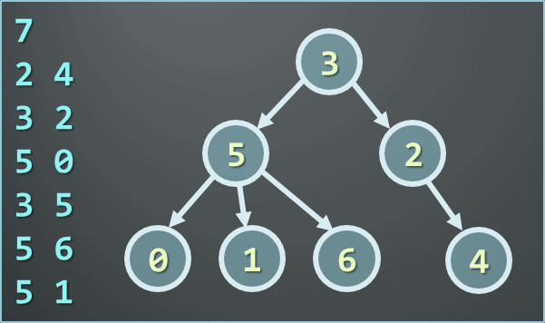

### Trees-and-Traversals

1. You are given a **tree of N nodes** represented as a set of `N-1` pairs of nodes (parent node, child node), each in the range (`0..N-1`).
   Example:
   
   
   
   Write a program to read the tree and find:
   
    <ol type="a">
       <li>the root node</li>
       <li>all leaf nodes</li>
       <li>all middle nodes</li>
       <li>the longest path in the tree</li>
       <li>(*) all paths in the tree with given sum `S` of their nodes</li>
       <li>(*) all subtrees with given sum `S` of their nodes</li>
    </ol>

2. Write a program to traverse the directory `C:\WINDOWS` and all its subdirectories recursively and to display all files matching the mask `*.exe`. Use the class `System.IO.Directory`.

3. Define classes `File { string name, int size }` and `Folder { string name, File[] files, Folder[] childFolders }` and using them build a tree keeping all files and folders on the hard drive starting from `C:\WINDOWS`. Implement a method that calculates the sum of the file sizes in given subtree of the tree and test it accordingly. Use recursive DFS traversal.
